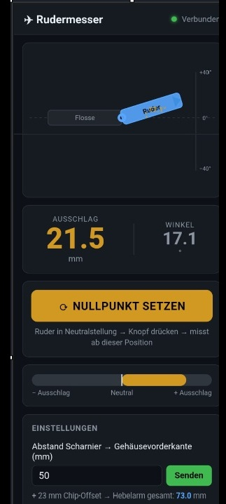

# Rudermesser (Arduino Nano 33 BLE)

Misst den Ruderausschlag eines Modellflugzeugs in Millimetern und zeigt ihn live auf dem Smartphone an - per Bluetooth.

 



---

## Was macht das Projekt?

Ein Arduino Nano 33 BLE wird an das Ruder eines Modellflugzeugs geklemmt. Der eingebaute IMU-Sensor (LSM9DS1) misst den Winkel der Ruderbewegung und rechnet ihn in Millimeter Ausschlag um. Die Anzeige erfolgt live auf dem Smartphone über eine Web-App per Bluetooth (BLE).

---

## Berechnung

```
mm Ausschlag = sin(Winkel) × (Hebelarm + 23 mm)
```

- **23 mm** = fester Offset (Vorderkante Gehäuse bis IMU-Chip-Mitte)
- **Hebelarm** = Abstand Scharnierachse bis Gehäusevorderkante (in der App einstellbar)

---

## Benötigte Hardware

| Teil | Beschreibung |
|------|--------------|
| Arduino Nano 33 BLE | Mikrocontroller mit BLE + IMU (LSM9DS1) |
| 1S LiPo | Akku zur Stromversorgung (z.B. 500 mAh) |

### Stromversorgung

- LiPo **+** → Arduino **3.3V Pin**
- LiPo **−** → Arduino **GND Pin**

> Ein voller 1S LiPo (4.2V) liegt knapp über 3.3V - der interne Regler verträgt das. Achtung: kein Tiefentladeschutz, Akku rechtzeitig laden.

---

## Teil A: Firmware auf den Arduino laden

Du brauchst **PlatformIO** (kostenlos) - als VS Code Extension oder als PlatformIO Core.

### 1. Projekt herunterladen
- Oben auf den grünen **"Code"** Knopf → **"Download ZIP"**
- ZIP entpacken

### 2. Projekt öffnen
- Ordner in VS Code / Kiro öffnen (mit PlatformIO Extension)

### 3. Arduino anschließen
- Arduino Nano 33 BLE per USB an den PC anschließen

### 4. Hochladen
- In PlatformIO auf **Upload** klicken (Pfeil-Symbol)
- Oder im Terminal:
  ```
  pio run -t upload
  ```
- Beim ersten Mal werden automatisch alle Bibliotheken heruntergeladen

> **Tipp:** Falls der Upload fehlschlägt ("No device found"), den **Reset-Knopf am Arduino zweimal schnell drücken** (Doppelklick) und dann erneut hochladen. Der Nano 33 BLE wechselt beim Upload kurz den COM-Port.

---

## Teil B: Web-App einrichten

Die Web-App läuft als **PWA (Progressive Web App)** und funktioniert nach der Installation offline. Web Bluetooth funktioniert nur in **Chrome auf Android** (nicht auf iOS).

### Variante 1: Über GitHub Pages (empfohlen)

Wenn du die App über GitHub Pages hostest, brauchst du keinen eigenen Webserver:

1. Im Repository unter **Settings → Pages** die Quelle auf `main` / `root` stellen
2. Nach ein paar Minuten ist die App erreichbar unter:
   `https://DEINNAME.github.io/REPONAME/webapp/`
3. Diese Adresse auf dem Handy in **Chrome** öffnen
4. **3-Punkte-Menü → "App installieren"** → die App liegt dann auf dem Homescreen und läuft offline

### Variante 2: Lokal über den PC (zum Testen)

1. Im `webapp` Ordner einen lokalen Webserver starten (Python):
   ```
   python -m http.server 8080 --directory webapp
   ```
2. PC-IP-Adresse herausfinden (`ipconfig`)
3. Am Handy im gleichen WLAN: `http://<PC-IP>:8080` öffnen

---

## Bedienung

1. Arduino ans Ruder montieren und mit Strom versorgen
2. Web-App öffnen (Chrome auf Android)
3. **"Verbinden"** drücken → **"Rudermesser"** auswählen
4. Ruder in Neutralstellung → **"Nullpunkt setzen"**
5. Bei Einstellungen den Abstand Scharnier → Gehäusevorderkante eingeben → **"Senden"**
6. Ruder bewegen → Ausschlag in mm ablesen

---

## Projektstruktur

```
Rudder Messen/
├── platformio.ini     PlatformIO Konfiguration (Board, Bibliotheken)
├── src/
│   └── main.cpp       Arduino Firmware (IMU auslesen, BLE senden)
├── webapp/            Web-App (PWA)
│   ├── index.html
│   ├── style.css
│   ├── app.js
│   ├── manifest.json
│   ├── service-worker.js
│   └── icon-192.png / icon-512.png
└── cad/               3D-Gehäuse (STL / STEP zum Drucken)
```

---

## Verwendete Bibliotheken

- Arduino_LSM9DS1 (IMU-Sensor)
- ArduinoBLE (Bluetooth)

Beide werden von PlatformIO automatisch installiert.

---

## Einbaulage / Achsen anpassen

Der Arduino ist um 180° gedreht eingebaut (USB hinten). Das wird in der Firmware korrigiert. Falls die Messung die falsche Achse oder Richtung zeigt, kann in `src/main.cpp` in der Funktion `getAngle()` die Achse angepasst werden.

---

## Fehlerbehebung

| Problem | Lösung |
|---------|--------|
| Upload "No device found" | Reset-Knopf 2x schnell drücken, erneut hochladen |
| App findet kein Gerät | Nur Chrome auf Android, Bluetooth am Handy an |
| Werte falsch herum | Achse/Vorzeichen in `getAngle()` anpassen |
| Nullpunkt nicht exakt 0 | Nach dem Kalibrieren kurz warten (Filter) |

---

## Schwesterprojekt

Für eine plattformunabhängige Lösung (Android **und** iPhone, ohne Bluetooth, ohne App-Installation) siehe **Rudder Messen ESP32** - dort läuft alles über einen WLAN-Hotspot des ESP32.
